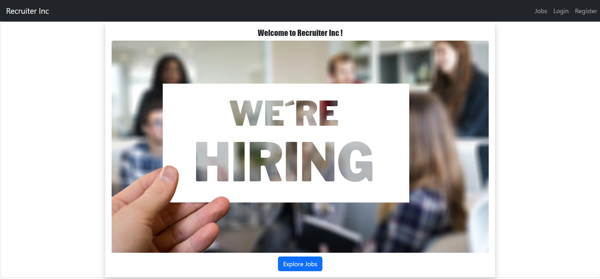
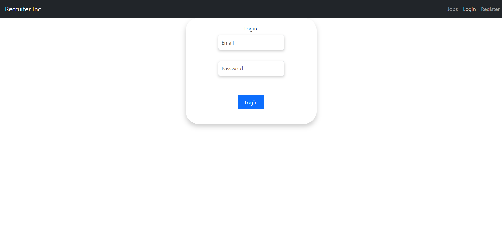

<p align="center">
<a href="" target="_blank" rel="noopener noreferrer">
 
 </a>
</p>

<h3 align="center">Recruiter Inc
</h3>

---

<p align="center"> An awesome Project to describe README 
    <br> 
<a href='https://www.meraki-academy.org'>Demo</a>
    <br> 
</p>

## 📝 Table of Contents

- [📝 Table of Contents](#-table-of-contents)
- [🧐 About ](#-about-)
- [🏁 Getting Started ](#-getting-started-)
  - [Prerequisites](#prerequisites)
  - [Installing:](#installing)
- [🎈 Usage ](#-usage-)
- [⛏️ Built Using ](#️-built-using-)
- [User Story ](#user-story-)
- [Data Flow ](#data-flow-)
- [⚠️ Guided By ](#️-guided-by-)

## 🧐 About <a name = "about"></a>

Are you looking for a quick and easy way to post your company's job offers on a platform and let the users apply without personally coming to your company? Recruiter Inc is the platform for you. It helps you to post job offers, update them delete them, and see the people who applied to your job offer. Recruiter Inc provides a simple design to ensure having the best user experience.

## 🏁 Getting Started <a name = "getting_started"></a>

These instructions will get you a copy of the project up and running on your local machine for development and testing purposes.

### Prerequisites

- Visual Studio Code follow this <a href=''>link</a> to install.
- Git Bash follow this <a href=''>link</a> to install.
- MongoDB follow this <a href=''>link</a> to install.
- Node.js follow this <a href=''>link</a> to install.

### Installing:

1. Clone the repo to your local machine using git bash.

```
git clone https://github.com/your_username_/Project-Name.git
```

2. Install packeges repeat this step in backend and frontend folder

```
npm i
```

3. Run server using git bash inside backend folder

```
npm run dev
```

4. Run application using git bash inside frontend folder

```
npm run start
```

Now app ready to use

## 🎈 Usage <a name="usage"></a>


- You don't have to register to navigate our web app!
- 
- You can click on the Recruiter Inc Button provided in the navigation bar to view the landing section.
- 
- Register Page
- 
-  Login Page
  

## ⛏️ Built Using <a name = "built_using"></a>

- [MongoDB](https://www.mongodb.com/) - Database
- [Express JS](https://expressjs.com/) - Server Framework
- [React JS](https://https://reactjs.org/) - Web Framework
- [Node JS](https://nodejs.org/en/) - Server Environment
- [React BootStrap](https://react-bootstrap.github.io/) - Style Framework

## User Story <a name = "#user_story"></a>

Your trello board link
<a href="https://trello.com/b/dlehmeBx/job-search-platform">Trello</a>

## Data Flow <a name = "#data_flow"></a>

</a>

## ⚠️ Guided By <a name = "guided_by"></a>

This project is guided by ©️ **[MERAKI Academy](https://www.meraki-academy.org)**